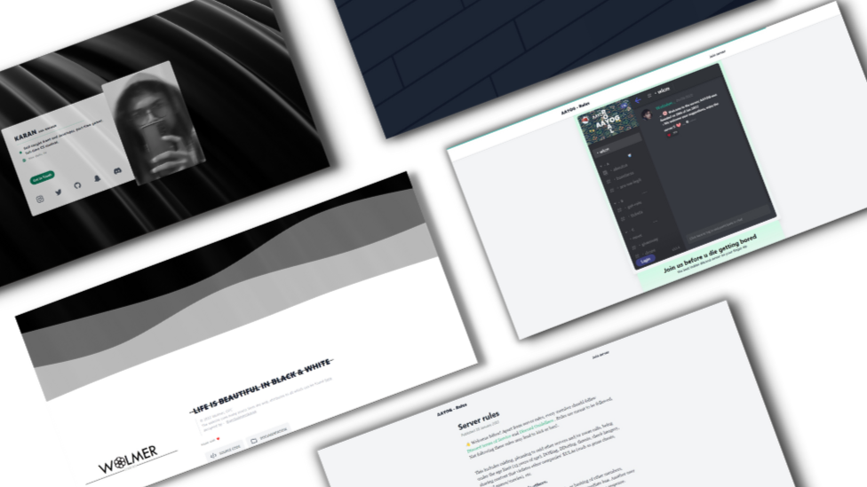

 
# WOL-PORTAL 

My first Web project = My portpholio!! It's been a long journey since I pushed myself into the Tailwind CSS world, but it was amazing! It doesn't give you any components; it asks you to create your ones! And that is the most important thing to improve yourself in my opinion. It's been a great learning experience for me, and I think I've learned and improved myself a lot.

It is my website that I use daily, so I had to include everything that I needed.

## Features

- Light/dark mode toggle
- Live discord server preview
- Fullscreen mode
- Cross platform
- Simple and minimalistic UI

## Info

Repo size :

Total lines of code : 

Deployment : 

Last update : 

Discord Online : 
## Authorsls
- [@wolmer-afk](https://www.github.com/wolmer-afk)

## License

[MIT](https://choosealicense.com/licenses/mit/)

## Used By

This project is used by the following authorities:

- [Wolmer, OPC](https:/wolmer.cf/)
- [AAYOG Discord server](https://wolmer.cf/redirect/discord)

